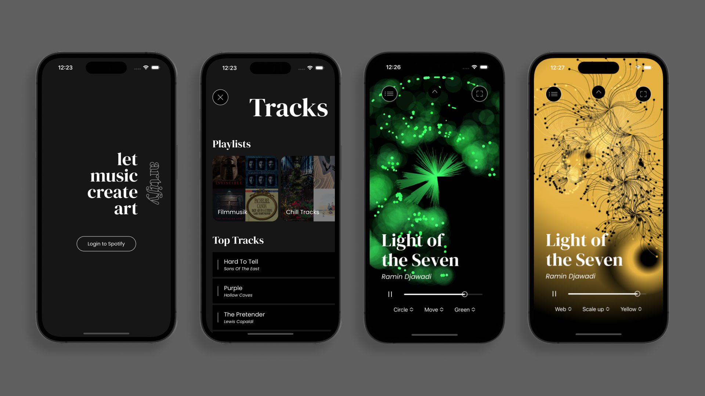

# Artify

iOS-App to visualize audio data from Spotify songs

*student project in semester 6 (work in progress)* 

**Features:**
- Connect to Spotify account
- Select song and control spotify player
- Interact with visualization: choose type and color and manipulate shapes (scaling and moving elements)

## Main Technologies
- SwiftUI
- Sprite Kit

How to run: run application in XCode

## Impressions
